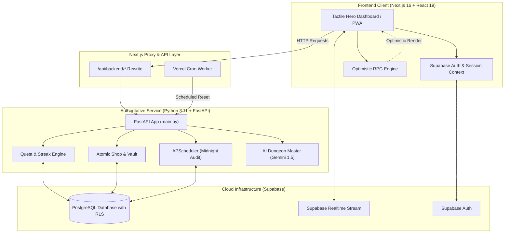

<div align="center">

# ⚔️ LifeRPG

**Transform Daily Habits, Fitness, and Chores into an Epic RPG Adventure.**

[](https://nextjs.org/)
[](https://react.dev/)
[](https://www.typescriptlang.org/)
[](https://fastapi.tiangolo.com/)
[](https://python.org/)
[](https://supabase.com/)
[](https://tailwindcss.com/)
[](LICENSE)

<br />

[Explore Features](#-features) •
[Architecture](#-system-architecture) •
[Quick Start](#-quick-start) •
[Environment Configuration](#-environment-variables) •
[API Reference](#-api-reference) •
[Database Setup](#-database-setup) •
[Deployment](#-deployment)

</div>

---

## 📖 Overview

**LifeRPG** is a gamified self-improvement and task management web application designed to eliminate procrastination by replacing negative friction with positive, dopamine-rich RPG progression loops.

Every real-life activity—whether lifting weights, studying algorithms, doing laundry, or meditating—grants **attribute-specific XP**, **gold currency**, and **streak multipliers**. As you level up your hero character, you unlock real-world custom rewards from your self-curated Loot Shop, embark on multiplayer co-op party raids, and slay communal procrastination bosses.

---

## 🌟 Features

### 🎮 1. RPG Progression Engine
- **Attribute System**: Every quest maps directly to one of four hero attributes:
  - 🏋️ **Brawn (STR)**: Workouts, physical fitness, sports, and endurance.
  - 🧠 **Intellect (INT)**: Deep work, coding, reading, and learning.
  - ⚡ **Swiftness (AGI)**: Quick chores, inbox zero, organization, and errands.
  - ❤️ **Vitality (VIT)**: Sleep hygiene, nutrition, hydration, and mental well-being.
- **Dynamic XP Curve**: Non-linear level progression algorithm requiring quadratic XP scaling for higher tiers.
- **Streak Multipliers**: Consecutive daily quest completions grant compound streak multipliers and bonus gold rolls.
- **Critical Gold Drops**: Random dice rolls upon quest completion yield critical gold bonuses.

### 🤖 2. AI Dungeon Master (Google Gemini)
- Translate vague human goals (e.g. *"I want to prepare for a half-marathon in 8 weeks"*, *"Master full-stack Next.js and Python"*) into structured multi-stage RPG questlines.
- Auto-assigns attribute types, difficulty tiers (Easy, Medium, Hard, Legendary), XP rewards, and suggested frequencies.
- Built-in fallback procedural questline generator ensuring continuous uptime even when external AI quotas expire.

### 💰 3. Custom Loot Shop & Economy
- **Guilt-Free Rewards**: Define your own real-world self-rewards (e.g., *"1 Hour of Steam Gaming"*, *"Artisan Latte"*, *"Weekend Movie Night"*).
- **Hard Economy**: Rewards cost hard-earned gold earned solely through productive habits.
- **Atomic Balance Transactions**: Server-audited gold deductions prevent duplicate or invalid redemptions.

### 🛡️ 4. Multiplayer Guilds & Co-Op Raids
- **Party Accountability**: Form adventuring parties with friends, colleagues, or family.
- **Boss Battles**: Pool party daily damage to fight communal procrastination monsters.
- **Global & Attribute Leaderboards**: Compete across the realm for highest levels, longest streaks, and attribute dominance.

### 📱 5. Tactile UI & Progressive Web App (PWA)
- **Satisfying Haptic Interactions**: Built with Framer Motion tactile spring physics, confetti explosions, and dopamine burst overlays.
- **100% Mobile & Desktop Ready**: Full PWA support with offline asset caching, service worker background sync, and installable app manifest.
- **High-DPI Adaptive Favicons & Icons**: Pixel-perfect multi-resolution icons (16px to 512px) compatible with all modern browsers and Google Search result snippet standards.

---

## 🏗️ System Architecture

LifeRPG uses a dual-engine architecture: a high-performance Next.js 16 frontend with optimistic state updates paired with an authoritative Python FastAPI backend and Supabase PostgreSQL.



---

## 💻 Tech Stack

### Frontend
- **Framework**: [Next.js 16.3.5](https://nextjs.org/) (App Router, Turbopack)
- **UI Library**: [React 19.2.8](https://react.dev/)
- **Styling**: [Tailwind CSS v4](https://tailwindcss.com/) & Vanilla CSS design tokens
- **Animations**: [Framer Motion 13](https://www.framer.com/motion/) & [Canvas Confetti](https://github.com/catdad/canvas-confetti)
- **Icons**: [Lucide React](https://lucide.dev/)
- **Data Rendering**: [react-markdown](https://github.com/remarkjs/react-markdown) & [remark-gfm](https://github.com/remarkjs/remark-gfm)
- **PWA**: Custom Service Worker (`public/sw.js`) + Web App Manifest

### Backend
- **Language**: Python 3.11+
- **API Framework**: [FastAPI 0.110](https://fastapi.tiangolo.com/)
- **Validation**: [Pydantic v2](https://docs.pydantic.dev/) & `pydantic-settings`
- **ASGI Server**: [Uvicorn](https://www.uvicorn.org/)
- **Task Scheduler**: [APScheduler 3.10](https://apscheduler.readthedocs.io/)
- **AI Engine**: [Google Generative AI SDK](https://ai.google.dev/) (`google-generativeai`)
- **HTTP Client**: [HTTPX](https://www.python-httpx.org/)

### Database & Cloud
- **Database**: [Supabase PostgreSQL](https://supabase.com/) with Row Level Security (RLS)
- **Authentication**: Supabase Auth (Email/Password, OAuth)
- **Deployment**: [Vercel](https://vercel.com/) (Frontend & Serverless Python functions)

---

## 📁 Repository Structure

```text
life-rpg/
├── api/                     # Vercel serverless Python entrypoint
│   ├── index.py             # Serverless ASGI bridge to FastAPI
│   └── requirements.txt     # Python serverless dependencies
├── app/                     # Next.js 16 App Router pages & metadata
│   ├── layout.tsx           # Global layout, SEO tags, JSON-LD Schema
│   ├── page.tsx             # Public landing showcase
│   ├── dashboard/           # Authenticated Hero Dashboard
│   ├── community/           # Guild & leaderboard showcase
│   ├── login/               # Sign-in & account creation
│   ├── profile/             # Hero character sheet & stats
│   ├── settings/            # Account & notification settings
│   ├── sitemap.ts           # Dynamic search engine sitemap
│   ├── robots.ts            # Crawl budget & robots directive
│   ├── manifest.ts          # Web App Manifest
│   └── favicon.ico          # Multi-resolution master icon
├── backend/                 # Authoritative Python FastAPI backend
│   ├── main.py              # FastAPI app initialization & CORS
│   ├── run.py               # Local development entrypoint
│   ├── config.py            # Pydantic Settings & environment parsing
│   ├── database.py          # Supabase client singleton
│   ├── models/              # Pydantic schemas (quests, shop, user)
│   ├── routers/             # API routes (quests, shop, cron, ai)
│   └── services/            # Business logic (XP math, Gemini DM)
├── components/              # Reusable React components
│   ├── motion/tactile.tsx   # Tactile spring buttons, counters, badges
│   ├── providers.tsx        # Auth and state providers
│   └── pwa-register.tsx     # Client-side service worker registration
├── lib/                     # Client libraries and utilities
│   ├── auth-context.tsx     # Supabase auth state & active user sync
│   ├── backend-client.ts    # Typed client with graceful fallback
│   ├── rpg-engine.ts        # Math models, leveling curves, XP calculators
│   └── supabase/            # Client and server Supabase helpers
├── public/                  # Static assets, icons, service worker
│   ├── sw.js                # Offline service worker
│   ├── icon-512.png         # High-resolution brand icon
│   ├── favicon-48x48.png    # Google Search snippet icon
│   └── og-image.png         # Social OpenGraph card (1200x630)
├── supabase/                # Database migrations & schemas
│   └── schema.sql           # Complete schema, tables, and RLS policies
├── next.config.ts           # Next.js rewrites, headers & optimizations
├── vercel.json              # Vercel rewrites & scheduled cron config
└── package.json             # Node dependencies and scripts
```

---

## 🚀 Quick Start

### Prerequisites
- **Node.js**: v18.18.0 or higher (v20+ recommended)
- **Python**: v3.10 or v3.11
- **Package Manager**: `npm`, `pnpm`, or `bun`
- **Supabase Account**: A free Supabase project ([supabase.com](https://supabase.com))

---

### Step 1: Clone Repository

```bash
git clone https://github.com/DakshSingh-GitHub/life-rpg.git
cd life-rpg
```

---

### Step 2: Database Initialization

1. Open your project in the [Supabase Dashboard](https://supabase.com/dashboard).
2. Navigate to the **SQL Editor** tab.
3. Paste and run the entire contents of [`supabase/schema.sql`](supabase/schema.sql).
4. This script provisions:
   - Tables: `profiles`, `quests`, `rewards`, `inventory`, `guilds`, `user_streaks`.
   - Automated triggers for updating profile levels upon XP thresholds.
   - Row Level Security (RLS) policies protecting individual user records.

---

### Step 3: Configure Environment Variables

#### Frontend Configuration (`.env.local`)
Create a `.env.local` file in the root directory:

```env
# Supabase (Settings -> API)
NEXT_PUBLIC_SUPABASE_URL=https://your-project-id.supabase.co
NEXT_PUBLIC_SUPABASE_ANON_KEY=your-anon-key

# App URL & SEO
NEXT_PUBLIC_APP_URL=http://localhost:3000

# Backend URL (Optional in dev, defaults to local proxy)
NEXT_PUBLIC_BACKEND_URL=http://127.0.0.1:8000

# Optional Search Engine Verification
NEXT_PUBLIC_GOOGLE_SITE_VERIFICATION=
NEXT_PUBLIC_BING_SITE_VERIFICATION=
```

#### Backend Configuration (`backend/.env`)
Create a `backend/.env` file:

```env
SUPABASE_URL=https://your-project-id.supabase.co
SUPABASE_KEY=your-anon-or-service-role-key
PORT=8000
HOST=0.0.0.0
CORS_ORIGINS=http://localhost:3000,http://127.0.0.1:3000
TIMEZONE=Asia/Kolkata

# Optional AI Dungeon Master (Google Gemini API key)
GEMINI_API_KEY=your-google-gemini-api-key
```

---

### Step 4: Install Dependencies & Run

#### Terminal A: Start Python FastAPI Backend

```bash
cd backend
python -m venv venv

# Windows PowerShell:
.\venv\Scripts\Activate.ps1
# Linux/macOS:
# source venv/bin/activate

pip install -r requirements.txt
python run.py
```
*The backend server will start on [http://localhost:8000](http://localhost:8000).*
*Interactive Swagger docs will be accessible at [http://localhost:8000/docs](http://localhost:8000/docs).*

#### Terminal B: Start Next.js Frontend

```bash
# From repository root
npm install
npm run dev
```
*The webapp will launch on [http://localhost:3000](http://localhost:3000).*

---

## 🔑 Environment Variables

| Variable | Scope | Description | Default / Example |
| :--- | :--- | :--- | :--- |
| `NEXT_PUBLIC_SUPABASE_URL` | Frontend & API | Public Supabase project API URL | `https://xyz.supabase.co` |
| `NEXT_PUBLIC_SUPABASE_ANON_KEY` | Frontend | Supabase anonymous public client key | `eyJhbGci...` |
| `NEXT_PUBLIC_APP_URL` | Frontend | Production base URL used for canonical links & SEO | `https://liferpg.app` |
| `NEXT_PUBLIC_BACKEND_URL` | Frontend | Dedicated backend API URL (if deployed separately) | `http://127.0.0.1:8000` |
| `SUPABASE_KEY` | Backend | Supabase service-role or anon key for backend queries | `eyJhbGci...` |
| `PORT` | Backend | Port for FastAPI Uvicorn listener | `8000` |
| `HOST` | Backend | Host bind address | `0.0.0.0` |
| `CORS_ORIGINS` | Backend | Comma-delimited permitted CORS origins | `http://localhost:3000` |
| `GEMINI_API_KEY` | Backend | Google AI Studio key for AI Dungeon Master | `AIzaSy...` |
| `TIMEZONE` | Backend | Timezone used by APScheduler for midnight rollover | `Asia/Kolkata` |

---

## 📡 API Reference

The authoritative FastAPI service handles core business logic and database writes:

### Quests & Progression
- `GET /api/quests/user/{user_id}` — Fetch all active, completed, and recurring bounties.
- `POST /api/quests/{quest_id}/complete` — Complete a quest, calculate XP gains, trigger streak increases, roll for bonus gold, and update database state.
- `POST /api/quests` — Create a custom quest or habit.

### Custom Shop & Inventory
- `GET /api/shop/items` — Fetch catalog of custom loot rewards.
- `POST /api/shop/redeem` — Atomically deduct user gold and grant an inventory reward item.
- `GET /api/shop/unlocked/{user_id}` — List all redeemed rewards and armory unlocks.

### AI Dungeon Master
- `POST /api/ai/generate-questline` — Sends objective to Gemini 1.5 to generate a multi-stage RPG quest sequence.
- `POST /api/ai/enroll-questline` — Batch registers an entire generated questline into the user's quest log.

### Automation & Maintenance
- `POST /api/cron/midnight-reset` — Triggered daily to reset recurring habits and evaluate streak maintenance.
- `GET /api/cron/status` — Inspect background scheduler health, next trigger time, and registered jobs.

---

## 🗄️ Database Setup

The database schema is organized around core RPG entities:

```text
profiles        -> User character statistics, overall level, attribute XP, gold pouch
quests          -> Daily habits, bounties, difficulty tiers, attribute tags
rewards         -> Custom loot shop rewards catalog and gold costs
inventory       -> Record of redeemed loot and cosmetics
user_streaks    -> Streak counts, freeze tokens, and rollover logs
guilds          -> Multiplayer party roster, member ranks, and shared boss damage
```

All tables include **Row Level Security (RLS)** policies ensuring users can only read and mutate their own personal game records.

---

## 🔍 SEO & Search Engine Capabilities

LifeRPG incorporates advanced search engine standards:
- **Google Favicon Standard**: Ships a 48×48px icon ([`public/favicon-48x48.png`](public/favicon-48x48.png)) and multi-size `.ico` satisfying Google Search result crawler requirements.
- **Structured Data (Schema.org)**: Complete JSON-LD graph with `WebSite`, `Organization`, `WebApplication`, and `FAQPage` schemas for enhanced SERP rich snippets and search sitelinks.
- **Social Media Cards**: Standardized OpenGraph and Twitter `summary_large_image` tags targeting 1200×630 dimensions.
- **Dynamic Sitemap & Robots**: Fully automated [`app/sitemap.ts`](app/sitemap.ts) and [`app/robots.ts`](app/robots.ts) directing search engines to index public showcase pages while protecting private dashboards.

---

## 🚢 Deployment

### Deploying on Vercel

1. Push your code to a GitHub repository.
2. Import the project into [Vercel](https://vercel.com/new).
3. Under **Environment Variables**, add:
   - `NEXT_PUBLIC_SUPABASE_URL`
   - `NEXT_PUBLIC_SUPABASE_ANON_KEY`
   - `NEXT_PUBLIC_APP_URL` (e.g. `https://your-domain.vercel.app`)
   - `SUPABASE_KEY`
   - `GEMINI_API_KEY`
4. Deploy! Vercel will automatically build the Next.js frontend and configure the Python serverless function routed via [`vercel.json`](vercel.json).

---

## 🤝 Contributing

Contributions, feedback, and bug reports are welcome!

1. Fork the repository.
2. Create a feature branch (`git checkout -b feature/epic-quest-feature`).
3. Commit your changes (`git commit -m 'Add epic quest feature'`).
4. Push to the branch (`git push origin feature/epic-quest-feature`).
5. Open a Pull Request.

---

## 📜 License

This project is licensed under the [MIT License](LICENSE) — feel free to use and adapt it for personal growth and open-source projects.
